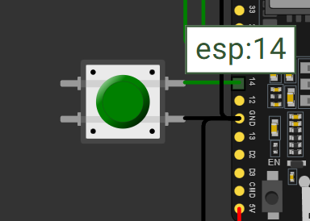
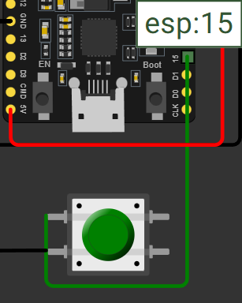
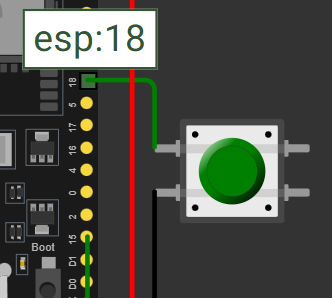
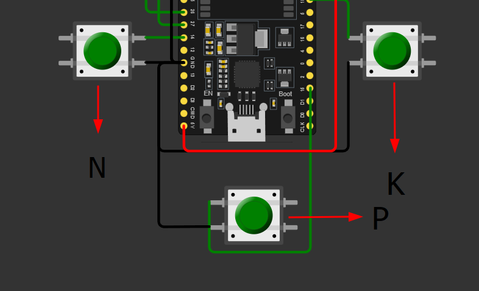
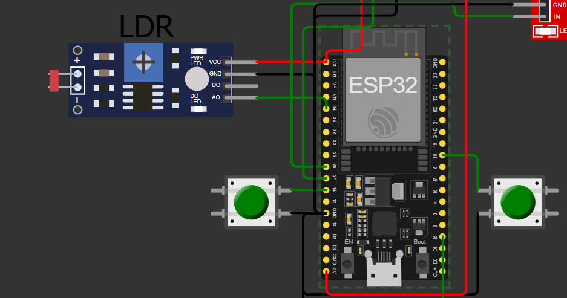
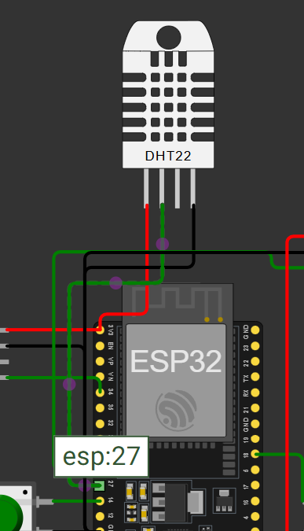
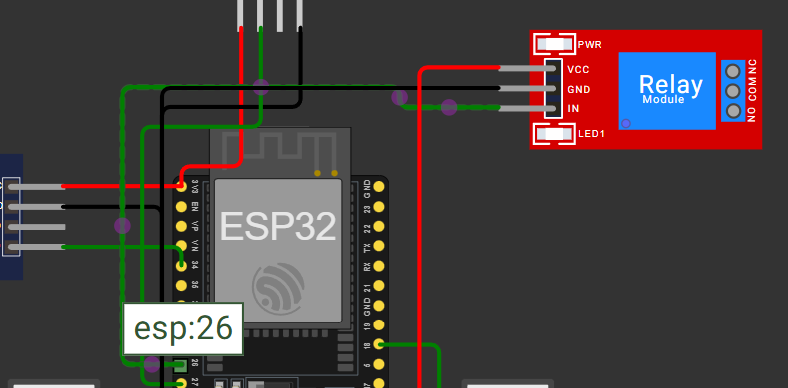
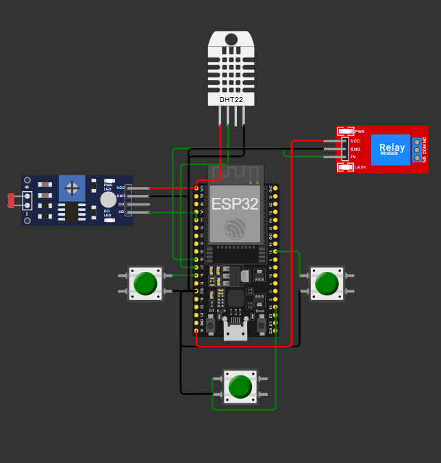

# Sistema de Irrigação Automática da Cultura de Milho

Projeto realizado para a Fase 2 CAP 1 - Um Mapa do Tesouro. Usando o simulador Browser Wokwi para utilizarmos o **ESP32** e conjuntos de componentes eletrônicos para simularmos um ambiente agrícola.

Monitorndo a umidade, pH e nutrientes (NPK) do solo, simulando uma irrigação automatizada com base nas condições ideais para o cultivo do **milho**

## Objetivo do Projeto.

Coletar os dados da cultura escolhida (Milho);
Dados como nivel de Nutrientes **NPK**;
Nível do **pH** do solo;
Nível de **humidade** do solo;
Realizar a irrigação automática baseado nos dados coletados;
Demonstrar ao Usuário a coleta e o resultado dessa coleta de **dados** através do Monitor Serial;

## Lógica de Funcionamento

O sistema toma decisões com base nas seguintes condições:

### A bomba é **ligada** quando:
- Todos os nutrientes estão adequados (botões pressionados);
- O pH está entre **5.5 e 7.0**, considerado ideal para o milho;
- A umidade está **abaixo de 50%**, indicando solo seco.

### A bomba é **desligada** quando:
- A umidade ultrapassa **70%** (solo úmido);
- O pH está fora da faixa ideal;
- Algum nutriente está em falta.

## Video demonstrativo
Assista ao video onde explicamos o projeto pelo link abaixo

[Link do Video](https://youtu.be/5PLMMO5RLZY)

## Imagens

### Conexão dos Botões

## LDR

## DHT22

## Relé

## Circuito completo 

