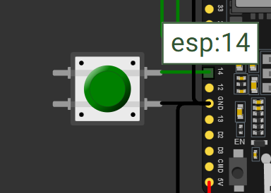
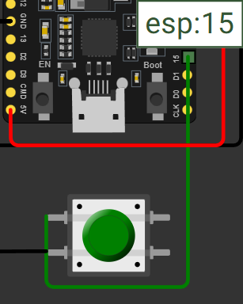
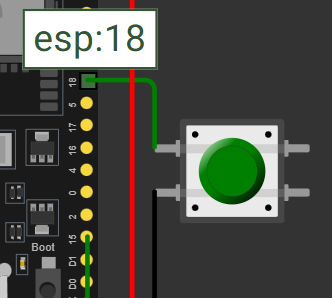
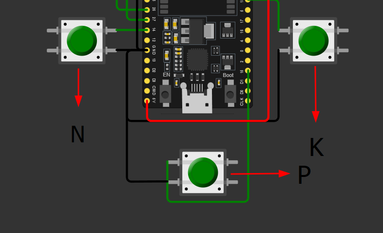
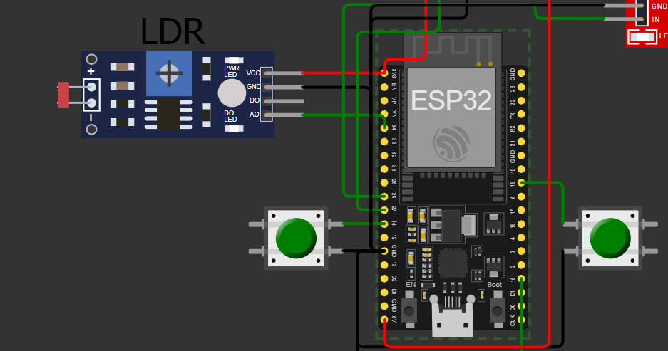
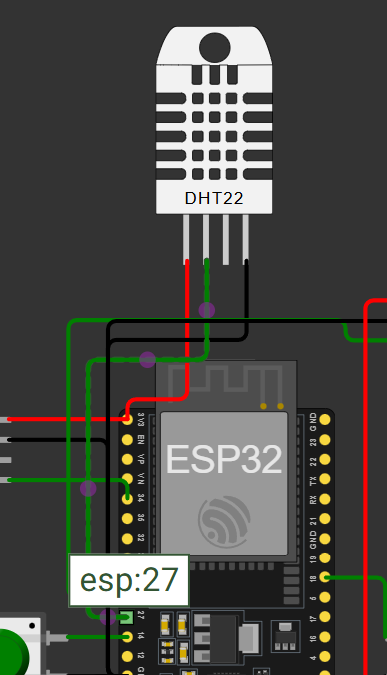
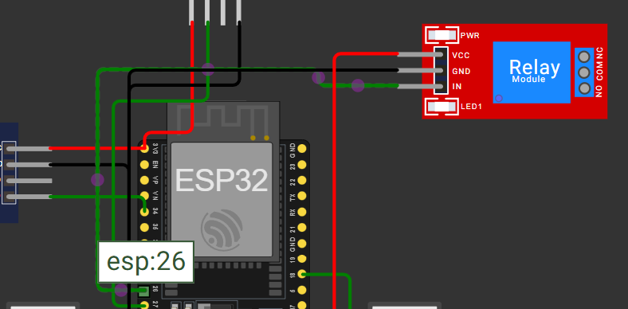
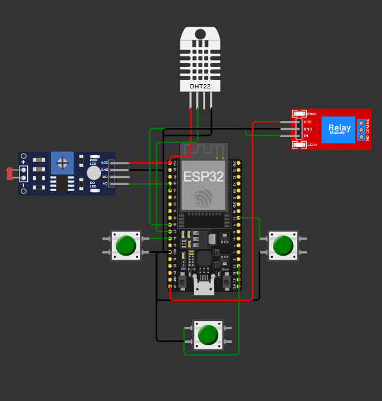

# FIAP - Faculdade de Informática e Administração Paulista

 

# Simulador de Irrigação

## 👨‍🎓 Integrantes: 
- <a>Durval de Oliveira Dorta Junior RM567007</a>
- <a> Murilo Ferreira Borges RM567738</a>

## 👩‍🏫 Professores:
### Tutor(a) 
- <a> Ana Cristina dos Santos</a>
### Coordenador(a)
- <a> André Godoi Chiovato</a>

## 📜 Descrição

Projeto realizado para a Fase 2 CAP 1 - Um Mapa do Tesouro. Usando o simulador Browser Wokwi para utilizarmos o **ESP32** e conjuntos de componentes eletrônicos para simularmos um ambiente agrícola.

Monitorndo a umidade, pH e nutrientes (NPK) do solo, simulando uma irrigação automatizada com base nas condições ideais para o cultivo do **milho**

## 📁 Estrutura de pastas

Dentre os arquivos e pastas presentes na raiz do projeto, definem-se:

- <b>.github</b>: Nesta pasta ficarão os arquivos de configuração específicos do GitHub que ajudam a gerenciar e automatizar processos no repositório.

- <b>assets</b>: aqui estão os arquivos relacionados a elementos não-estruturados deste repositório, como imagens.

- <b>src</b>: Todo o código fonte criado para o desenvolvimento do projeto ao longo das 7 fases.

- <b>README.md</b>: arquivo que serve como guia e explicação geral sobre o projeto (o mesmo que você está lendo agora).

## 🔧 Como executar o código

Usar a IDE **Wokwi** e baixando a biblioteca DHT sensor library.

## Video demonstrativo

[Link do Video](https://youtu.be/5PLMMO5RLZY)

## Lógica de Funcionamento

O sistema toma decisões com base nas seguintes condições:

### A bomba é **ligada** quando:
- Todos os nutrientes estão adequados (botões pressionados);
- O pH está entre **5.5 e 7.0**, considerado ideal para o milho;
- A umidade está **abaixo de 50%**, indicando solo seco.

### A bomba é **desligada** quando:
- A umidade ultrapassa **70%** (solo úmido);
- O pH está fora da faixa ideal;
- Algum nutriente está em falta.

## 📋 Licença

<a property="dct:title" rel="cc:attributionURL" href="https://github.com/agodoi/template">MODELO GIT FIAP</a> por <a rel="cc:attributionURL dct:creator" property="cc:attributionName" href="https://fiap.com.br">Fiap</a> está licenciado sobre <a href="http://creativecommons.org/licenses/by/4.0/?ref=chooser-v1" target="_blank" rel="license noopener noreferrer" style="display:inline-block;">Attribution 4.0 International</a>.

=======

## Objetivo do Projeto.

Coletar os dados da cultura escolhida (Milho);
Dados como nivel de Nutrientes **NPK**;
Nível do **pH** do solo;
Nível de **humidade** do solo;
Realizar a irrigação automática baseado nos dados coletados;
Demonstrar ao Usuário a coleta e o resultado dessa coleta de **dados** através do Monitor Serial;

## Imagens

### Conexão dos Botões

## LDR

## DHT22

## Relé

## Circuito completo 

